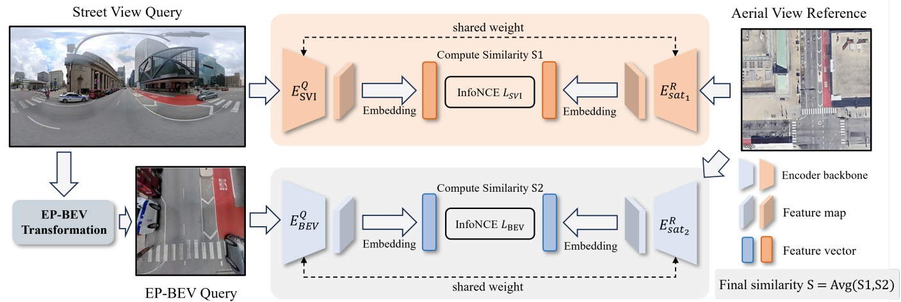

## Abstract
Cross-view geolocalization identifies the geographic location of street view images by matching them with a georeferenced satellite database. Significant challenges arise due to the drastic appearance and geometry differences between views. In this paper, we propose a new approach for cross-view image geo-localization, i.e.,  the Panorama-BEV Co-Retrieval Network. Specifically, by utilizing the ground plane assumption and geometric relations, we convert street view panorama images into the BEV view, reducing the gap between street panoramas and satellite imagery. In the existing retrieval of street view panorama images and satellite images, we introduce BEV and satellite image retrieval branches for collaborative retrieval. By retaining the original street view retrieval branch, we overcome the limited perception range issue of BEV representation. Our network enables comprehensive perception of both the global layout and local details around the street view capture locations. Additionally, we introduce CVGlobal, a global cross-view dataset that is closer to real-world scenarios. This dataset adopts a more realistic setup, with street view directions not aligned with satellite images. CVGlobal also includes cross-regional, cross-temporal, and street view to map retrieval tests, enabling a comprehensive evaluation of algorithm performance.



## News
- Uploaded the training and testing code of the CVACT dataset
- Source code of BEV transformation is released（CVACT/CVUSA）.

## Installation
Clone this repo to a local folder:
```bash
git clone https://github.com/yejy53/EP-BEV.git
cd EP-BEV
```

## Environment Setup

```bash
conda create -n EP-BEV python=3.9 -y
conda activate EP-BEV
pip install -r requirements.txt
```


## Data Preparation
The publicly available datasets used in this paper can be obtained from the following sources: 

**Preparing CVUSA Dataset.**  The dataset can be downloaded [here](https://mvrl.cse.wustl.edu/datasets/cvusa). 

**Preparing CVACT Dataset.**  The dataset can be downloaded [here](https://github.com/Liumouliu/OriCNN). 

**Preparing VIGOR Dataset.**  The dataset can be downloaded [here](https://github.com/Jeff-Zilence/VIGOR/tree/main). 

**Preparing CVGlobal Dataset.**  The dataset can be downloaded [here](https://huggingface.co/datasets/Yejy53/CVGlobal). 


## Data Structure:

```
├─ CVACT
  ├── ACT_data.mat
  ├── ANU_data_small/
    ├── bev/
    ├── satview_polish/ 
    ├── streetview/	
  └──ANU_data_test/

```

## Use our pre-trained model for retrieval 
1. You can download a pre-trained model (e.g. cvact) from [huggingface](https://huggingface.co/Yejy53/EB-BEV-CVACT/tree/main) and place it in ckpt folder.
2. You need to organize the generated BEV images into the above dataset format. You can download the generated BEV images directly from the following [huggingface](https://huggingface.co/datasets/Yejy53/CVACT-BEV) link to get consistent results, or generate BEV images yourself and then retrain.
3. When performing Street View-BEV Co-Retrieval, you only need to add the similarity of using a pure Street View image to the similarity of using a BEV image. The weights for using Street View search can be obtained from the following [huggingface](https://huggingface.co/Yejy53/CVACT-Street/tree/main) link. The method and weights for using Street View search also can be found in the [Sample4G](https://github.com/Skyy93/Sample4Geo).

## ❤️ Acknowledgements

Our code is built on top of [Sample4G](https://github.com/Skyy93/Sample4Geo) and [Boosting3DoF](https://github.com/YujiaoShi/Boosting3DoFAccuracy). We appreciate the previous open-source works.
